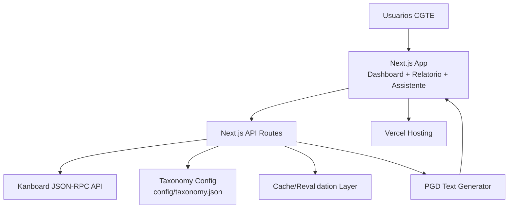
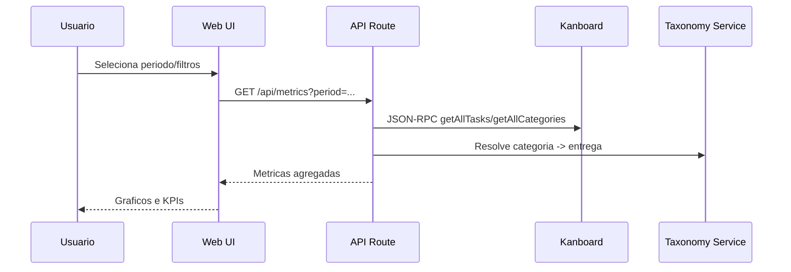
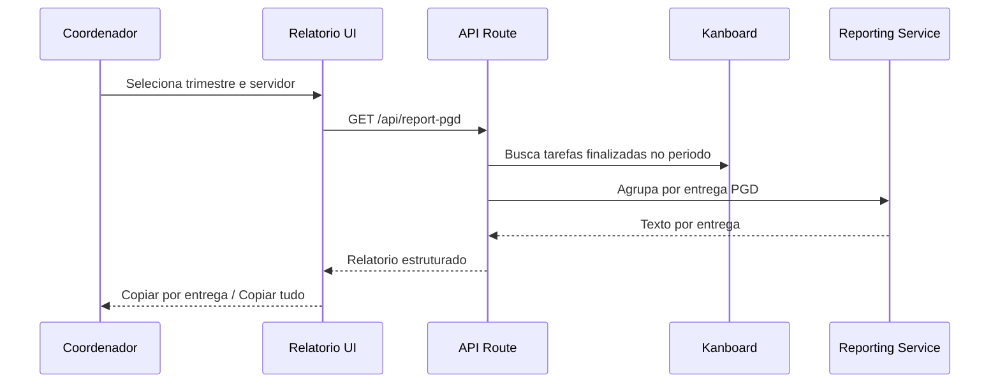

# Sistema de Gestao CGTE/Cefor - Architecture Document

**Status:** Reviewed - Action items before development  
**Version:** 0.2  
**Date:** 24/02/2026  
**Input Base:** `docs/prd.md` (v0.3 - Ready for Architect)

---

## 1. Introduction

Este documento define a arquitetura fullstack do Sistema de Gestao CGTE/Cefor para o MVP, cobrindo dashboard, geracao de relatorio PGD e base para assistente inteligente.

### 1.1 Starter Template or Existing Project

N/A - Greenfield project.

### 1.2 Change Log

| Date | Version | Description | Author |
|------|---------|-------------|--------|
| 24/02/2026 | 0.1 | Primeira versao da arquitetura com base no PRD v0.3 | @architect |
| 24/02/2026 | 0.2 | Execucao do architect-checklist e registro de riscos/acoes obrigatorias | @architect |

---

## 2. High Level Architecture

### 2.1 Technical Summary

O sistema adota arquitetura web fullstack em monorepo logico usando Next.js App Router como frontend e backend (Route Handlers) no mesmo deploy. A aplicacao consome a API JSON-RPC do Kanboard como sistema-fonte para tarefas, categorias e subtarefas, sem banco de dados proprio no MVP. A camada de configuracao local (`config/taxonomy.json`) resolve o mapeamento categoria -> entrega PGD, permitindo governanca sem hardcode. O deploy sera feito na Vercel com variaveis de ambiente seguras e revalidacao periodica de dados para dashboards. Essa arquitetura atende os objetivos do PRD: reduzir retrabalho do PGD, melhorar visibilidade gerencial e preparar a etapa de assistente com IA.

### 2.2 High Level Overview

- **Architectural Style:** Modular monolith (Next.js fullstack) com integracao externa (Kanboard API).
- **Repository Structure:** Monorepo unico (conforme PRD).
- **Service Architecture:** Next.js UI + API Routes como camada intermediaria.
- **Primary Data Flow:** Usuario -> Next.js UI -> API interna -> Kanboard JSON-RPC -> agregacao/mapeamento -> UI/relatorio.
- **Key Decisions:**
  - Usar Kanboard como fonte unica de dados no MVP.
  - Nao integrar Petrvs por API (saida em texto copiar/colar).
  - Priorizar Dashboard + Relatorio (Epics 1-3) antes da IA (Epic 4).

### 2.3 High Level Project Diagram



### 2.4 Architectural and Design Patterns

- **Modular Monolith:** Um unico app fullstack no MVP - _Rationale:_ menor custo operacional e entrega rapida para equipe pequena.
- **API Gateway Interno (BFF leve):** Route Handlers centralizam acesso ao Kanboard - _Rationale:_ evita token no cliente e padroniza erros/cache.
- **Repository/Adapter para Integracao Externa:** `kanboard-client` encapsula JSON-RPC - _Rationale:_ testabilidade e isolamento de mudancas da API externa.
- **Config-driven Mapping:** Taxonomia em arquivo versionado - _Rationale:_ governanca e ajuste sem recompilar regras de negocio.

---

## 3. Tech Stack (Definitivo para MVP)

### 3.1 Cloud Infrastructure

- **Provider:** Vercel
- **Key Services:** Next.js hosting, serverless functions, edge caching, env vars
- **Deployment Regions:** Primary: US (default Vercel). Ajuste futuro para requisito institucional.

### 3.2 Technology Stack Table

| Category | Technology | Version | Purpose | Rationale |
|----------|------------|---------|---------|-----------|
| Language | TypeScript | 5.x | Tipagem end-to-end | Padrao do PRD e seguranca de desenvolvimento |
| Runtime | Node.js | 20 LTS | Runtime backend | Compatibilidade com Next.js moderno |
| Frontend Framework | Next.js (App Router) | 16.x | UI + SSR + API routes | Definido no PRD |
| UI Library | React | 19.x | Componentes UI | Base do Next.js |
| Styling | Tailwind CSS | 3.x | Estilizacao | Definido no PRD |
| Component Kit | shadcn/ui | latest compatible | Componentes reutilizaveis | Definido no PRD |
| Data Fetching | Native fetch + cache/revalidate | nativo | Integracao SSR/ISR | Simplicidade para MVP |
| Charts | Recharts | 2.x | Graficos dashboard | Bom custo/beneficio para MVP |
| Backend API | Next.js Route Handlers | 16.x | Camada intermediaria | Evita backend separado no MVP |
| External Integration | Kanboard JSON-RPC 2.0 | API externa | Leitura/escrita de tarefas | Sistema de origem oficial |
| AI Provider (Epic 4) | Anthropic Claude API | API externa | Categorizacao assistida | Definido no PRD |
| Testing Unit | Vitest | 2.x | Testes unitarios | Rapido para TS |
| Testing Integration | Vitest + MSW | 2.x / 2.x | Mocks de API externa | Cobertura de integracao sem Kanboard real |
| E2E Testing | Playwright | 1.x | Fluxos criticos | Confianca em jornadas chave |
| Lint | ESLint | 9.x | Qualidade estatica | Gate de qualidade |
| Format | Prettier | 3.x | Padrao de codigo | Consistencia |
| Deploy | Vercel | managed | CI/CD simplificado | Decisao do PRD |
| Monitoring | Vercel Analytics + logs estruturados | managed | Observabilidade basica | Suficiente para MVP |

---

## 4. Data Models (Conceitual)

### 4.1 Task

**Purpose:** Representar tarefa do Kanboard no dominio local de relatorios e dashboard.

**Key Attributes:**
- `id: number` - identificador da tarefa no Kanboard
- `title: string` - titulo da tarefa
- `categoryId: number` - categoria Kanboard
- `columnId: number` - status/coluna Kanboard
- `ownerId?: number` - responsavel
- `dateCreation: number` - timestamp criacao
- `dateCompleted?: number` - timestamp conclusao

### 4.2 CategoryTaxonomy

**Purpose:** Mapear categoria Kanboard para entrega PGD.

**Key Attributes:**
- `categoryId: number`
- `categoryName: string`
- `area: "Design" | "Libras" | "Audiovisual" | "Gestao"`
- `entregasPGD: string[]`

### 4.3 PgdReportEntry

**Purpose:** Materializar uma entrega PGD no relatorio trimestral.

**Key Attributes:**
- `entregaId: string`
- `entregaNome: string`
- `tasks: Task[]`
- `summaryText: string`

---

## 5. Components

### 5.1 Web App (Next.js)

**Responsibility:** Interface de dashboard, relatorio PGD e assistente.

**Key Interfaces:**
- Paginas: `/`, `/dashboard`, `/relatorio-pgd`, `/assistente` (Epic 4)
- Componentes de filtro (periodo, area, servidor)

**Dependencies:** API interna, componentes UI, modulos de agregacao.

### 5.2 API Layer (Route Handlers)

**Responsibility:** Orquestrar chamadas ao Kanboard e expor endpoints internos.

**Key Interfaces:**
- `GET /api/health`
- `GET /api/tasks`
- `GET /api/metrics`
- `GET /api/report-pgd`
- `POST /api/assistant/suggest` (Epic 4)
- `POST /api/assistant/publish` (Epic 4)

**Dependencies:** `kanboard-client`, `taxonomy-service`, `report-service`.

### 5.3 Kanboard Client Adapter

**Responsibility:** Encapsular JSON-RPC com tipagem, timeout, retry e traducao de erros.

**Key Interfaces:**
- `getAllTasks()`
- `getTasksByProject(projectId)`
- `getAllCategories()`
- `getProjectById(projectId)`
- `getAllSubtasks(taskId?)`
- `createTask(payload)` (Epic 4)

### 5.4 Taxonomy Service

**Responsibility:** Carregar/validar `config/taxonomy.json` e resolver relacoes categoria-entrega.

### 5.5 Reporting Service

**Responsibility:** Agregar tarefas por periodo/categoria/entrega e gerar texto PGD.

---

## 6. External APIs

### 6.1 Kanboard API

- **Purpose:** Fonte de dados de tarefas e destino de publicacao de cards.
- **Documentation:** Instancia Kanboard institucional (JSON-RPC 2.0).
- **Authentication:** API token em variavel de ambiente.
- **Rate Limits:** Aplicar limite local de 10 req/s (conforme PRD Story 1.2 AC6).

**Key Methods Used:**
- `getAllTasks`
- `getAllCategories`
- `getProjectById`
- `getAllSubtasks`
- `createTask` (Epic 4)
- `createSubtask` (Epic 4)

### 6.2 Anthropic Claude API (Fase 2)

- **Purpose:** Classificacao e estruturacao de cards em linguagem natural.
- **Condition:** Implementar somente apos validacao de Epics 1-3.

---

## 7. Core Workflows

### 7.1 Dashboard Aggregation Flow



### 7.2 PGD Report Generation Flow



---

## 8. REST API Spec (MVP internal)

```yaml
openapi: 3.0.0
info:
  title: Sistema Gestao CGTE Internal API
  version: 0.1.0
  description: Internal API for dashboard, metrics and PGD report generation.
paths:
  /api/health:
    get:
      summary: Health check
      responses:
        "200":
          description: Service healthy
  /api/tasks:
    get:
      summary: Get tasks with filters
  /api/metrics:
    get:
      summary: Get aggregated metrics for dashboard
  /api/report-pgd:
    get:
      summary: Generate PGD report text by period
  /api/assistant/suggest:
    post:
      summary: Suggest structured task from natural language (Epic 4)
  /api/assistant/publish:
    post:
      summary: Publish approved task to Kanboard (Epic 4)
```

---

## 9. Database Schema

No MVP, nao ha banco de dados transacional proprio. Persistencia principal fica no Kanboard.

Persistencias locais de configuracao:
- `config/taxonomy.json` (categoria -> entrega PGD)
- possivel cache em memoria/revalidate (nao autoritativo)

Se houver necessidade futura (fase 2+), introduzir banco para:
- historico de interacoes do assistente
- auditoria de publicacoes
- configuracoes administrativas versionadas

---

## 10. Source Tree

```text
sistema-gestao-cgte/
|-- app/
|   |-- (dashboard)/
|   |   |-- page.tsx
|   |-- relatorio-pgd/
|   |   |-- page.tsx
|   |-- assistente/
|   |   |-- page.tsx
|   |-- api/
|   |   |-- health/route.ts
|   |   |-- tasks/route.ts
|   |   |-- metrics/route.ts
|   |   |-- report-pgd/route.ts
|   |   |-- assistant/
|   |       |-- suggest/route.ts
|   |       |-- publish/route.ts
|-- components/
|   |-- dashboard/
|   |-- report/
|   |-- assistant/
|   |-- ui/
|-- lib/
|   |-- kanboard-client.ts
|   |-- taxonomy.ts
|   |-- report-generator.ts
|   |-- metrics.ts
|   |-- validations.ts
|-- config/
|   |-- taxonomy.json
|-- tests/
|   |-- unit/
|   |-- integration/
|   |-- e2e/
|-- docs/
|   |-- prd.md
|   |-- architecture.md
|-- .env.example
|-- package.json
```

---

## 11. Infrastructure and Deployment

### 11.1 Deployment Strategy

- **Platform:** Vercel
- **Strategy:** Continuous deployment por branch (`preview`) e `main` (`production`)
- **Pipeline:** lint -> typecheck -> test -> deploy
- **Rollback:** Re-deploy para deployment estavel anterior na Vercel

### 11.2 Environments

- **Development:** local (`npm run dev`)
- **Preview:** deploy automatico por PR/branch
- **Production:** branch `main`

### 11.3 Required Environment Variables

- `KANBOARD_API_URL`
- `KANBOARD_API_TOKEN`
- `ANTHROPIC_API_KEY` (apenas Epic 4)
- `APP_TIMEZONE=America/Sao_Paulo`

---

## 12. Error Handling Strategy

- Padronizar erros de integracao externa em formato unico:
  - `code`
  - `message`
  - `details` (sem dados sensiveis)
  - `requestId`
- Timeouts para chamadas Kanboard com retry exponencial curto.
- Erros de indisponibilidade do Kanboard devem virar mensagens amigaveis na UI:
  - "Kanboard indisponivel no momento. Tente novamente."
- Logging estruturado com correlacao por request.

---

## 13. Security

- Sem login no MVP (conforme PRD), mas com API token protegido apenas no servidor.
- Nunca expor `KANBOARD_API_TOKEN` no cliente.
- Validar inputs de query/body em todos os endpoints.
- Rate limit em endpoints de escrita (assistente/publicacao).
- CORS restrito ao dominio da aplicacao.
- HTTPS obrigatorio (Vercel default).
- Nao logar segredos nem payload completo com dados sensiveis.

---

## 14. Test Strategy and Standards

- **Unit:** logica de mapeamento (`taxonomy`), agregacao (`metrics`/`report`), adaptador Kanboard (mocks).
- **Integration:** endpoints `/api/metrics` e `/api/report-pgd` com MSW.
- **E2E (prioritario):**
  - carregar dashboard com dados mockados
  - gerar relatorio trimestral e copiar texto
  - tratar erro de indisponibilidade do Kanboard
- **Quality Gates obrigatorios por story:**
  - `npm run lint`
  - `npm run typecheck`
  - `npm test`

---

## 15. Checklist Results Report

Checklist executado: `.aios-core/product/checklists/architect-checklist.md`  
Modo: Comprehensive (all at once)  
Artefatos usados: `docs/prd.md`, `docs/architecture.md`  
Artefatos ausentes: `docs/frontend-architecture.md`, `docs/front-end-spec.md`

### 15.1 Executive Summary

- **Architecture readiness:** Medium
- **Project type avaliado:** Full-stack com UI
- **Forca principal:** arquitetura coerente com PRD (Next.js fullstack + Kanboard como fonte unica)
- **Bloqueios principais:** falta documento de frontend dedicado; versoes de stack ainda em ranges (`x`)

### 15.2 Section Pass Rate (estimado)

| Section | Pass Rate | Observacao |
|---------|-----------|------------|
| 1. Requirements Alignment | 88% | Boa cobertura de FR/NFR; compliance institucional ainda generico |
| 2. Architecture Fundamentals | 92% | Diagramas e responsabilidades claros |
| 3. Technical Stack & Decisions | 72% | Falta pin de versoes exatas e comparativo de alternativas |
| 4. Frontend Design & Implementation | 40% | Falta `frontend-architecture.md` com detalhes de componente/roteamento |
| 5. Resilience & Operational Readiness | 76% | Boa base; faltam thresholds de alerta e fallback formal |
| 6. Security & Compliance | 78% | Controles base definidos; detalhamento de rede/compliance pendente |
| 7. Implementation Guidance | 84% | Estrutura e testes definidos; setup local ainda sem comandos reais |
| 8. Dependency & Integration Management | 70% | Integracoes mapeadas; estrategia de versionamento/patching pendente |
| 9. AI Agent Implementation Suitability | 86% | Modularidade boa; faltam templates de implementacao por camada |
| 10. Accessibility (Frontend) | 62% | WCAG AA citado, mas faltam criterios/testes operacionais |

### 15.3 Top 5 Risks and Mitigations

1. **Ausencia de frontend-architecture detalhada**  
   - Risco: implementacao inconsistente de UI, estado e roteamento.  
   - Mitigacao: criar `docs/frontend-architecture.md` antes das stories de Epic 2.
2. **Versoes tecnologicas nao pinadas**  
   - Risco: variacao de comportamento entre ambientes.  
   - Mitigacao: substituir `x` por versoes exatas na stack final.
3. **Observabilidade sem SLO/SLA operacional**  
   - Risco: falhas sem deteccao objetiva.  
   - Mitigacao: definir metricas/alertas minimos (erro, latencia, uptime).
4. **Estrategia de fallback Kanboard parcial**  
   - Risco: indisponibilidade externa interrompe fluxo principal.  
   - Mitigacao: formalizar politica de retry/backoff e fila temporaria para escrita (Epic 4).
5. **Acessibilidade sem plano de teste formal**  
   - Risco: nao conformidade WCAG AA em producao.  
   - Mitigacao: incluir checklist WCAG por story e automacao basica de testes.

### 15.4 Must-Fix Before Development

1. [DONE] Criar `docs/frontend-architecture.md` cobrindo:
   - organizacao de componentes
   - estrategia de estado
   - roteamento e navegacao
   - acessibilidade operacional (WCAG AA)
2. [PENDING] Pin de versoes exatas no stack arquitetural (sem `x`).
3. [PENDING] Definir baseline operacional minimo:
   - metricas de erro/latencia
   - limiares de alerta
   - procedimento de rollback por incidente.

### 15.5 Should-Fix (Quality)

1. Complementar estrategia de seguranca de infraestrutura (isolation e policies).
2. Definir politica de update de dependencias (cadencia e ownership).
3. Adicionar exemplos de implementacao para padroes criticos (API errors, validação, cache).

### 15.6 AI Implementation Readiness

- **Status:** Bom para inicio da Epic 1 (fundacao/integracao).
- **Hotspots para IA:** frontend state/routing (ainda sem documento dedicado), politicas de erro e observabilidade.
- **Recomendacao:** iniciar dev apenas apos must-fix 1 e 2.

---

## 16. Next Steps

1. @sm criar stories em `docs/stories/` com base nesta arquitetura e no PRD.
2. @dev implementar Epic 1 (setup, cliente Kanboard, taxonomy, PoC home).
3. @qa validar gates e cenarios criticos de integracao Kanboard.
4. @po validar aderencia com Marcos antes de iniciar Epic 2.
